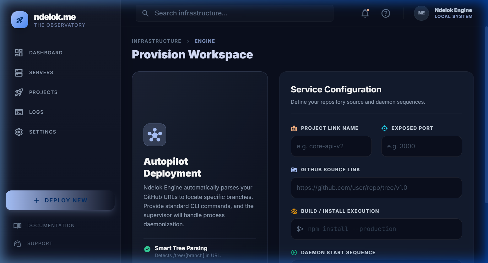

# Ndelok.me - Integrated Infrastructure Dashboard

**Ndelok.me** is a high-performance, real-time infrastructure management dashboard designed for local development and minor production environments. It provides a unified interface for monitoring system health, managing project deployments, and analyzing real-time server logs with persistent storage.


## 🚀 Key Features

- **Real-time Monitoring**: Live OS statistics including CPU, RAM, and Disk usage (per project) powered by Socket.io.
- **Project Management**: Control your services (Start, Stop, Restart, Edit, Delete) with a single click.
- **Smart Deployment**: Automated Git cloning and installation processes with branch/tag support.
- **Persistent Logging**: Centralized logging system with history retention and Export to TXT functionality.
- **Total Shutdown Logic**: Guarantees absolute process termination and port clearing when stopping/deleting.
- **Compact UI**: Modern, glassmorphism-inspired design optimized for efficiency.

---

## 📸 Screenshots

| Dashboard | Projects |
|-----------|----------|
|  |  |

| Servers | Logs |
|---------|------|
|  |  |

| Deployment |
|------------|
|  |

---

## 🛠️ Tech Stack

- **Frontend**: React + Vite
- **Styling**: Tailwind CSS (Premium Dark Theme)
- **Communication**: Socket.io (Real-time telemetry)
- **Backend Service**: Custom Vite Integration (Middleware Bridge to OS)
- **Database**: File-based persistence (`projects.json`, `system-logs.json`)

---

## ⚡ Getting Started

### Prerequisites
- Node.js (v18+)
- Git

### Installation

1. **Clone the repository**:
   ```bash
   git clone https://github.com/dikobokobok/ndelok.git
   cd ndelok
   ```

2. **Install dependencies**:
   ```bash
   npm install
   ```

3. **Run in development mode**:
   ```bash
   npm run dev
   ```

4. **Access the dashboard**:
   Open [http://localhost:5173](http://localhost:5173) (or the port specified in your terminal).

---

## 📖 Usage Guide

### 1. Monitoring System Health
The **Dashboard** tab provides real-time telemetry. "Critical Events" are now persistent and won't disappear on page refresh.

### 2. Deploying a New Project
Go to the **Deploy** page (Provision Workspace).
- Name your project.
- Provide a valid GitHub URL (supports branch/tree links like `.../tree/v2.1`).
- Set an Exposed Port for networking.
- Define Build and Start commands.

### 3. Managing Services
The **Project Registry** allows you to:
- **Stop**: Forcibly kill process trees and clear ports.
- **Edit**: Update port or exec commands without redeploying.
- **Delete**: Remove the project and its workspace from disk.

### 4. Logging & Export
The **Logs** section provides a unified stream. 
- Use the **Service Filter** to see logs for a specific project.
- Click **Export** to save the current filtered view to a `.txt` file.

---

## 🛡️ License
MIT License.

---

*Developed with ❤️ by dikobokobok*
