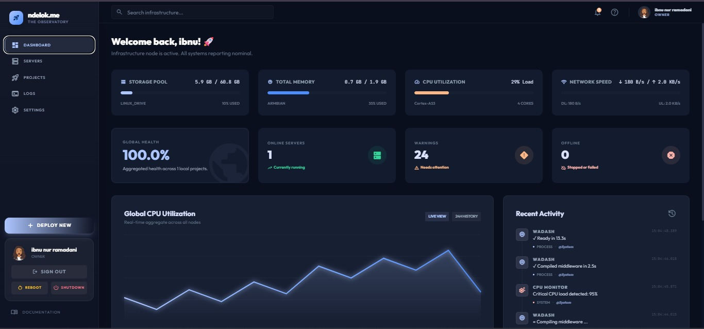
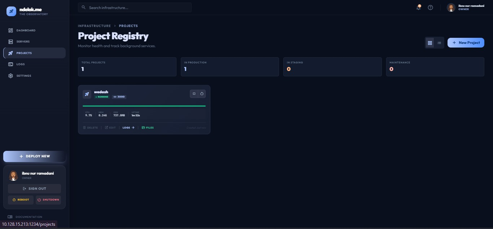
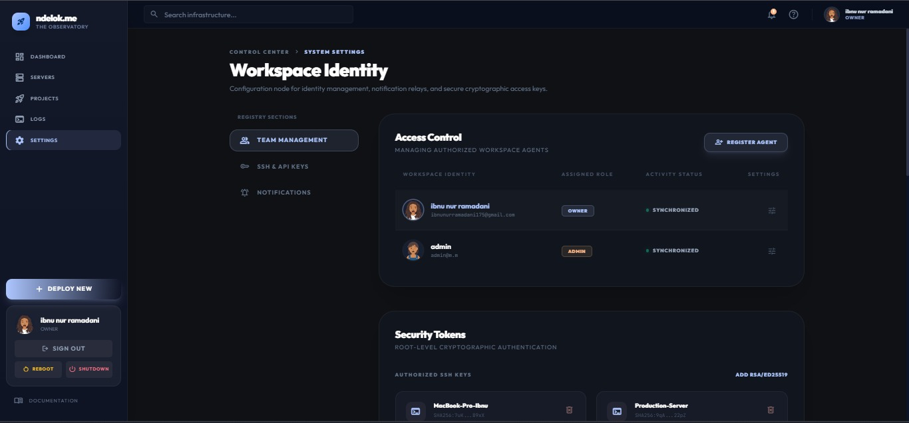
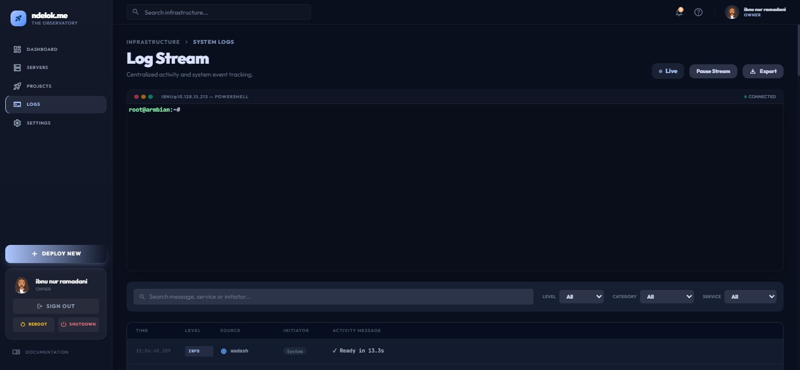

# Ndelok.me - Integrated Infrastructure Dashboard

**Ndelok.me** is a high-performance, real-time infrastructure management dashboard designed for local development and minor production environments. It provides a unified interface for monitoring system health, managing project deployments, and analyzing real-time server logs with persistent storage.



## 🚀 Key Features

- **Real-time Monitoring**: Live OS statistics including CPU, RAM, and Disk usage (per project) powered by Socket.io.
- **Audit Trail & Security**: Automatic logging of every state-changing API request (POST/PATCH/DELETE) with initiator tracking.
- **Project Management**: Control your services (Start, Stop, Restart, Edit, Delete) with a single click.
- **Smart Deployment**: Automated Git cloning and installation processes with branch/tag support.
- **Centralized Activity Logs**: Persistent logging system with category-based filtering (Security, Deployment, System, etc.).
- **Total Shutdown Logic**: Guarantees absolute process termination and port clearing when stopping/deleting.
- **Modern UI**: Bento-style grid, glassmorphism-inspired design with real-time interactive charts.

---

## 📸 Screenshots

| Dashboard | Projects |
|-----------|----------|
|  |  |

| Servers | Audit Logs |
|---------|------|
|  |  |

---

## 🛠️ Tech Stack

- **Frontend**: React + Vite (HMR enabled)
- **Styling**: Tailwind CSS (Premium Dark Theme)
- **Communication**: Socket.io (Real-time telemetry & log streaming)
- **Backend Service**: Custom Vite Integration (Middleware Bridge to OS & Process Spawning)
- **Database**: File-based persistence (`projects.json`, `system-logs.json`, `users.json`)

---

## ⚡ Getting Started

### Prerequisites
- Node.js (v18+)
- Git installed on host machine

### Installation

1. **Clone the repository**:
   ```bash
   git clone https://github.com/dikobokobok/ndelok.git
   cd ndelok
   ```

2. **Install dependencies**:
   ```bash
   npm install
   ```

3. **Run in development mode**:
   ```bash
   npm run dev
   ```

4. **Access the dashboard**:
   Open [http://localhost:5173](http://localhost:5173).

---

## 📖 Usage Guide

### 1. Monitoring System Health
The **Dashboard** provides real-time telemetry and a **Recent Activity** widget that summarizes the latest system and administrative events.

### 2. Deploying a New Project
Go to the **Provision Workspace** page.
- Select a unique Project Identifier.
- Provide a valid GitHub URL (supports branch/tree links).
- Define build and runtime commands (e.g., `npm install` and `npm run dev`).

### 3. Managing Services
The **Project Registry** allows for:
- **Stop**: Forcibly kill process trees and clear ports.
- **Edit**: Update configuration without full redeployment.
- **Restart**: Graceful restart with clean process spawns.

### 4. Categorized Logging & Audit
The **Logs** section provides a unified stream with advanced features:
- **Level Filter**: Filter by INFO, WARN, SUCCESS, or ERROR.
- **Category Filter**: Isolate Security, Deployment, Management, or Traffic logs.
- **Initiator Tracking**: See exactly which user or system event triggered an action.
- **Export Control**: Save the current filtered audit trail to a portable `.txt` file.

---

## 🛡️ License
MIT License.

---

*Developed with ❤️ by dikobokobok*
